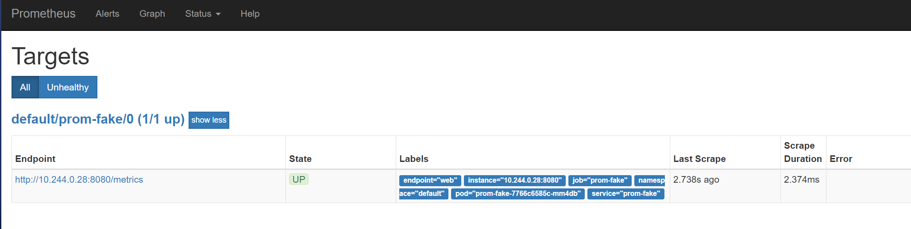
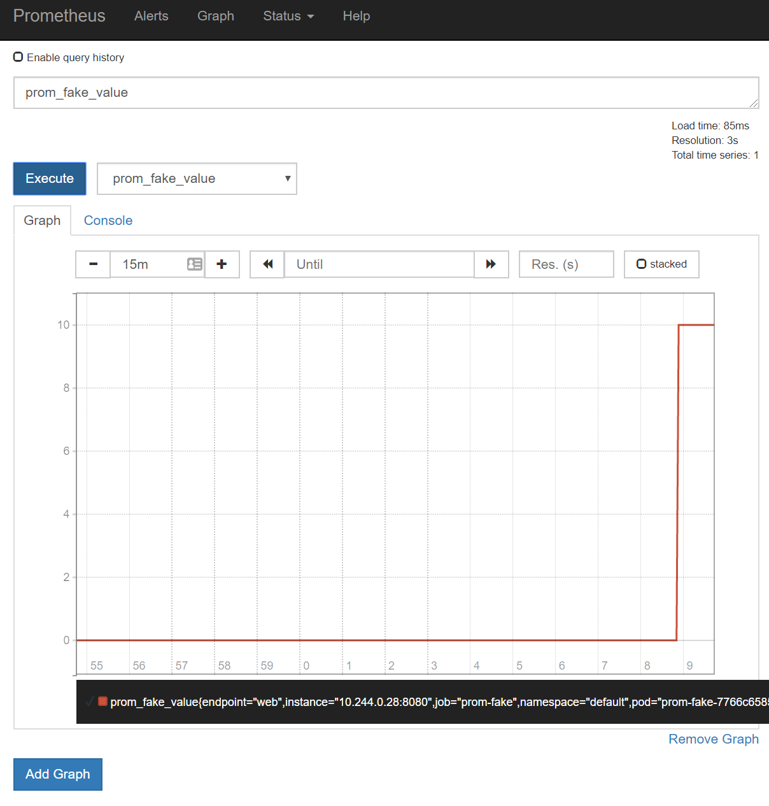

# NOTES

This repo provides a walkthrough for setting up a Kubernetes deployment scaled on custom metrics from using the Horizontal Pod Autoscaler (HPA). There is a good [walkthrough in the Kubernetes docs](https://kubernetes.io/docs/tasks/run-application/horizontal-pod-autoscale-walkthrough/) on using the HPA to scale on Pod CPU, but there are a number of steps that are not covered for using custom metrics. This repo will take you through getting Prometheus set up with a demo custom metric and configuring the HPA to use that.

A typical scenario for this would be to scale a deployment that is processing messages from a queue based on the queue depth. To keep the walkthrough simple we will use a custom metric source instead of a real queue - this lets us avoid have to script adding messages from the queue and processing them, but it should still be clear how to extend this walkthrough to a real scenario.

The overall set of steps we'll follow is:

1. Deploy the workload to be scaled
1. Deploy Prometheus (using `prometheus-operator`)
1. Build and deploy the custom metric source (`prom-fake`)
1. Deploy the Prometheus metrics adapter
1. Configure the Horizontal Pod Autoscaler

The essential flow is that we have a service that exposes Prometheus metrics. The `ServiceMonitor` CRD configures the Prometheus instance to capture the metrics from that service. These metrics are then exposes to Kubernetes by the Prometheus metrics adapter, and then the Horizontal Pod Autoscaler can use the metrics to scale the workload deployment.

```z
+------------------------------------------------+
| Deployment (workload to scale)                 |
|                                                |
| +------+  +------+  +------+       +------+    |
| |      |  |      |  |      |       |      |    |
| | Pod  |  | Pod  |  | Pod  |  ...  | Pod  |    |
| |      |  |      |  |      |       |      |    |
| +------+  +------+  +------+       +------+    |
|                                                |
+-----------+------------------------------------+
            ^
            |
            |
+-----------+------------------+
|                              |
| Horizontal Pod Autoscaler    |
|                              |
+-----------+------------------+
            ^
            |
            |
+-----------+------------------+
|                              |
|  prometheus metrics adapter  |
|                              |
+-----------+------------------+
            ^
            |                                           +--------------+
            |                                           | prom-fake    |
            |                                           |              |
+-----------+-----------+       +-------------------+   | +---------+  |
|                       |       |                   |   | |         |  |
| Prometheus instance   +------>+ Service Monitor   +---->+ Service |  |
| (deployed by          |       |                   |   | |         |  |
| prometheus-operator)  |       +-------------------+   | +---+-----+  |
|                       |                               |     |        |
+-----------------------+                               | +---+-----+  |
                                                        | |         |  |
                                                        | | Pod     |  |
                                                        | |         |  |
                                                        | +---------+  |
                                                        |              |
                                                        +--------------+

```

## Requirements

There are a number of pre-requesites for this walkthrough. These are listed below along with the versions that were used at the time of writing.

* Azure Kubernetes Service (AKS) cluster - v1.12.8
* Azure Container Registry
* [Azure CLI](https://docs.microsoft.com/en-us/cli/azure/install-azure-cli?view=azure-cli-latest) version 2.0.63
* Kubectl - v1.14.3
* [Helm](https://helm.sh) - v2.13.1

## Deploy the workload to be scaled

Since we're not really using a queue for the custom metric source in this walkthrough we don't need anything that can actually process messages for the workload that we're scaling, so we'll just use the `nginx` image as the image for our workload.

The `deploy-walkthrough.yaml` file describes creating a deployment with a single replica. Apply this to your cluster to create the workload:

```bash
kubectl apply -f deploy-workload.yaml
```

## Deploy Prometheus

There are various ways to deploy Prometheus. For this walkthrough we will deploy it in-cluster using the Prometheus operator. This allows us to deploy a `prometheus` instance and then to create `ServiceMonitor` instances that the operator uses to dynamically reconfigure the Prometheus instance configuration.

### Deploy the Prometheus operator

The `prometheus-operator` project has a [Getting Started guide](https://github.com/coreos/prometheus-operator/blob/master/Documentation/user-guides/getting-started.md#example-prometheus-operator-manifest)

For convenience, there is a `deploy-prometheus-operator-namespace.yaml` in this repo that can be used to install the operator into a namespace called `prom-metrics`:

```bash
kubectl create namespace prom-metrics
kubectl apply -f deploy-prometheus-operator-namespace.yaml --namespace=prom-metrics
```

### Deploy a Prometheus instance

In the previous step we deployed the Prometheus operator, now we will use that to create an actual Prometheus instance. The `prometheus-operator` project Getting Started guide has a sections on [enabling RBAC for Prometheus](https://github.com/coreos/prometheus-operator/blob/master/Documentation/user-guides/getting-started.md#enable-rbac-rules-for-prometheus-pods) and [creating a prometheus instance](https://github.com/coreos/prometheus-operator/blob/master/Documentation/user-guides/getting-started.md#include-servicemonitors)

Again, for convenience, there is a `deploy-prometheus-instance.yaml` in that repo that can be used to install an instance of Prometheus. This manifest names the instance Prometheus and sets up the `serviceMonitorSelector` to `prometheus-instance: prometheus1` - this will be important when we set up the `ServiceMonitor` later.

```bash
kubectl apply -f deploy-prometheus-instance-namespace.yaml --namespace=prom-metrics
```

## Build and deploy the custom metric source - `prom-fake`

For this walkthrough we will build and run a pod that allows us to easily report different metrics so that we don't have to worry about setting up a queue and loading it with messages. This is the `prom-fake` application. In a real scenario this would be something like a queue that the deployment to be scaled is processing messages from.

`prom-fake` is a web application and exposes the two endpoints: `/metrics` and `/value`

The `/metrics` endpoint exposes metrics in the Prometheus format. This includes the custom `prom_fake_value` metric.

The `/value` endpoint provides an easy way to get/set the value of the `prom_fake_value` metric.

These endpoints are illustrated below

```bash
# These examples assume that you are running prom-fake locally

# Get the current value
$ curl localhost:8080/value
0

# Set to a new value (123)
$ curl localhost:8080/value -d 123

# Get the current value
$ curl localhost:8080/value
123
```

### Configuring AKS with access to ACR

The first step is to build the `prom-fake` image and push it to our registry, so we need the cluster to be able to pull from the registry - if you already have configured your cluster to access your registry then you can skip most of this step (you still need to set up the variables below as they are used in later steps).

It is assumed that you have already created an AKS cluster and an Azure Container Registry (ACR). Below are steps to configure the AKS cluster to be able to pull images from the ACR (full docs are [here](https://docs.microsoft.com/en-us/azure/container-registry/container-registry-auth-aks))

The first step is to set up some variables to point to your cluster and registry:

```bash
export AKS_RESOURCE_GROUP=<name of the resource group with your AKS cluster>
export AKS_CLUSTER_NAME=<name of your AKS cluster>
export ACR_RESOURCE_GROUP=<name of the resource group with your registry>
export ACR_NAME=<name of your registry>
```

Grant permissions for your cluster to access your registry:

```bash
# Get the id of the service principal configured for AKS
CLIENT_ID=$(az aks show --resource-group $AKS_RESOURCE_GROUP --name $AKS_CLUSTER_NAME --query "servicePrincipalProfile.clientId" --output tsv)

# Get the ACR registry resource id
ACR_ID=$(az acr show --name $ACR_NAME --resource-group $ACR_RESOURCE_GROUP --query "id" --output tsv)

# Create role assignment to allow pulling images
az role assignment create --assignee $CLIENT_ID --role acrpull --scope $ACR_ID
```

### Build prom-fake

We will use the registry to perform the build of the `prom-fake` instance. Ensure that you have configured the variables in the previous step and then run the following command.

```bash
az acr build -t prom-fake -f prom-fake/Dockerfile prom-fake --resource-group $ACR_RESOURCE_GROUP --registry $ACR_NAME
```

### Deploy prom-fake

We will we create a deployment for `prom-fake` which serves up our custom metrics. We will also deploy a service that exposes that deployment as it is needed to connect this to Prometheus.

To deploy `prom-fake`, update the `deploy-prom-fake.yaml` to have the correct image for the deployment (based on your registry name) and then run:

```bash
kubectl apply -f deploy-prom-fake.yaml
```

To test that this is running correctly, first we get the IP address of the `prom-fake` service:

```bash
PROMFAKE_IP=$(kubectl  get service prom-fake  --output=jsonpath="{.status.loadBalancer.ingress[0].ip}")
```

Then we can query the `/value` API:

```bash
curl "http://$PROMFAKE_IP:8080/value"
```

Then we can set it to a new value:

```bash
curl "http://$PROMFAKE_IP:8080/value" --data 10

curl "http://$PROMFAKE_IP:8080/value"
```

And we can query the `/metrics` endpoint to see the metrics that we will configure Prometheus to pull:

```bash
curl "http://$PROMFAKE_IP:8080/metrics"
```

### Configure Prometheus to pull prom-fake metrics

Now that we have the `prom-fake` serving up metrics we need to configure Prometheus to pull these metrics. To do this we create a `ServiceMonitor` type (defined by the Prometheus operator) that causes the Prometheus configuration to be updated to pull metrics.

The ServiceMonitor looks like

```yaml
apiVersion: monitoring.coreos.com/v1
kind: ServiceMonitor
metadata:
  name: prom-fake
  labels:
    prometheus-instance: prometheus1
spec:
  selector:
    matchLabels:
      app: prom-fake
  namespaceSelector:
    matchNames:
      - default
  endpoints:
  - port: web
    interval: 5s
```

There are three parts to the `ServiceMonitor` type: which Prometheus instance that should pick up this configuration, which service to retrieve metrics from and what endpoint(s) on that service to use to retrieve metrics.

Under `metadata`, the `prometheus-instance: prometheus1` label matches the `serviceMonitorSelector` that we specificed when we created the Prometheus instance earlier. This enables the reconfiguration of the Prometheus instance using these settings.

Under `spec` is the `selector` which uses a `matchLabels` section to give the labels that are used to identify the service to monitor. There is also the `endpoints` section which specifies which endpoint(s) to monitor. Here we are specifying `web` which is the name of the HTTP endpoint that exposes the `/metrics` endpoint. If you aren't using the default port or path (`/metrics`) then these can be overridden in this section. The spec also has the `namespaceSelector` property which we use to tell Prometheus which Kubernetes namespace the service to monitor is in. This is important when splitting across namespaces as the `ServiceMonitor` must be created in the same namespace as the Prometheus instance. 

To deploy the `ServiceMonitor` run:

```bash
kubectl apply -f deploy-prom-fake-servicemonitor-namespace.yaml --namespace=prom-metrics
```

To test this we can port-forward the Prometheus port and check the metric in the UI.

To set up port-forwarding run the following command and then browse to <http://localhost:9090/targets>

```bash
kubectl port-forward --namespace=prom-metrics prometheus-prometheus-0 9090
```
<!-- NOTE WSL2 preview - add `--address 0.0.0.0` to bind to all adapters as the WSL instance a separate VM and not on localhost -->

You should see output similar to the following screenshot showing the prom-fake endpoint listed.



Now navigate to <http://localhost:9090/graph> and enter 'prom_fake_value' as the expression (you can select it from the drop-down list if you prefer), click on 'Graph', and then click 'Execute'. You should see a graph showing the metric with the value we last set when testing the prom-fake deployment



If you prefer to test from the command line then you can query the Prometheus HTTP API with `curl -s localhost:9090/api/v1/query?query=prom_fake_value` which will give you output similar to the output below (formatted with jq). Note the `value` of `10` which we last set.

```json
{
    "status": "success",
    "data": {
        "resultType": "vector",
        "result": [
            {
                "metric": {
                    "__name__": "prom_fake_value",
                    "endpoint": "web",
                    "instance": "10.244.0.28:8080",
                    "job": "prom-fake",
                    "namespace": "default",
                    "pod": "prom-fake-7766c6585c-mm4db",
                    "service": "prom-fake"
                },
                "value": [
                    1560863536.684,
                    "10"
                ]
            }
        ]
    }
}

```

## Deploy the Prometheus metrics adapter

Now that we have the metrics in Prometheus we need to expose them via the Kubernetes metric API. To do this we will use the `prometheus-adapter` project and we will install this using its [Helm chart](https://github.com/helm/charts/blob/master/stable/prometheus-adapter/README.md). Since we have customised the namespace for the Prometheus instance we need to override the default Prometheus URL value by setting the `prometheus.url` value when we install the chart.


```bash
helm install --namespace prom-metrics --name prometheus-adapter stable/prometheus-adapter --set prometheus.url=http://prometheus.prom-metrics.svc
```

As the helm installation output states, once the adapter is running, we can query the metrics API via `kubectl get --raw /apis/custom.metrics.k8s.io/v1beta1`. We can also query directly for the `prom_fake_value` metric using `kubectl get --raw /apis/custom.metrics.k8s.io/v1beta1/namespaces/default/pods/*/prom_fake_value` which gives output as shown below (formatted with jq).

```json
{
    "kind": "MetricValueList",
    "apiVersion": "custom.metrics.k8s.io/v1beta1",
    "metadata": {
        "selfLink": "/apis/custom.metrics.k8s.io/v1beta1/namespaces/default/pods/%2A/prom_fake_value"
    },
    "items": [
        {
            "describedObject": {
                "kind": "Pod",
                "namespace": "default",
                "name": "prom-fake-7766c6585c-mm4db",
                "apiVersion": "/v1"
            },
            "metricName": "prom_fake_value",
            "timestamp": "2019-06-18T13:42:40Z",
            "value": "10"
        }
    ]
}
```

### Configure the Horizontal Pod Autoscaler

Now that we have the custom metric exposed via the Kubernetes metrics API we can configure the Horizontal Pod AutoScaler (HPA) to scale the number of replicas for our workload deployment.

If we were scaling based on CPU we could run a command like  `kubectl autoscale deployment nginx --cpu-percent=50 --min=1 --max=10`. This would scale the deployment between 1 and 10 replicas in an attempt to keep the average CPU utilisation around 50%. If we query the autoscaler that this created for us using `kubectl get hpa.v2beta2.autoscaling nginx -o yaml` we would get output similar to the YAML below (which has had the extra metadata and status elements stripped out).

```yaml
apiVersion: autoscaling/v2beta2
kind: HorizontalPodAutoscaler
metadata:
  name: nginx
  namespace: default
spec:
  maxReplicas: 10
  metrics:
  - resource:
      name: cpu
      target:
        averageUtilization: 50
        type: Utilization
    type: Resource
  minReplicas: 1
  scaleTargetRef:
    apiVersion: extensions/v1beta1
    kind: Deployment
    name: nginx
```

In the YAML above we can see how the simple `--cpu-percent=50` has been mapped into the `metrics` section. Using this YAML as a starting point, we can edit the metrics to use our custom metric instead of the built-in resource metric for CPU as shown below.

```yaml
apiVersion: autoscaling/v2beta2
kind: HorizontalPodAutoscaler
metadata:
  name: nginx
  namespace: default
spec:
  maxReplicas: 10
  metrics:
   - type: Object
     object:
      describedObject:
        kind: service
        name: prom-fake # <== this references the service that is exposing the metric
      metric:
        name: prom_fake_value # <== this is the name of the metric to use for scaling
      target:
        type: Value
        value: 10
  minReplicas: 1
  scaleTargetRef:
    apiVersion: extensions/v1beta1
    kind: Deployment
    name: nginx
```

This YAML is in `deploy-workload-autoscaler.yaml` so we can deploy the autoscaler using

```bash
kubectl apply -f deploy-workload-autoscaler.yaml
```

We can then use `kubectl get hpa nginx` and `kubectl describe hpa nginx` to see how the HPA is working. The output from the first command gives us a summary of the HPA status, while the second command gives more detail about the reason for the current number of replicas.

```bash
$ kubectl get hpa nginx
NAME    REFERENCE          TARGETS        MINPODS   MAXPODS   REPLICAS   AGE
nginx   Deployment/nginx   10/10          1         10        1          13s

$ k describe hpa nginx
Name:                                                     nginx
Namespace:                                                default
Labels:                                                   <none>
CreationTimestamp:                                        Tue, 18 Jun 2019 15:43:07 +0100
Reference:                                                Deployment/nginx
Metrics:                                                  ( current / target )
"prom_fake_value" on service/prom-fake (target value):  10 / 10
 Min replicas:                                             1
 Max replicas:                                             10
 Deployment pods:                                          1 current / 1 desired
Conditions:
  Type            Status  Reason              Message
  ----            ------  ------              -------
  AbleToScale     True    ReadyForNewScale    recommended size matches current size
  ScalingActive   True    ValidMetricFound    the HPA was able to successfully calculate a replica count from service metric prom_fake_value
  ScalingLimited  False   DesiredWithinRange  the desired count is within the acceptable range
Events:           <none>
16:52 $ k get hpa -w                                                                                                                                                        NAME    REFERENCE          TARGETS   MINPODS   MAXPODS   REPLICAS   AGE
nginx   Deployment/nginx   10/10     1         10        1          69m
nginx   Deployment/nginx   50/10     1         10        1          69m
^C✘-1 ~/source/hpa-walkthrough [master|✚ 1…2]
16:52 $ k describe hpa nginx                                                                                                                                                Name:                                                     nginx
Namespace:                                                default
Labels:                                                   <none>
Annotations:                                              kubectl.kubernetes.io/last-applied-configuration:
                                                            {"apiVersion":"autoscaling/v2beta2","kind":"HorizontalPodAutoscaler","metadata":{"annotations":{},"name":"nginx","namespace":"default"},"s...
CreationTimestamp:                                        Tue, 18 Jun 2019 15:43:07 +0100
Reference:                                                Deployment/nginx
Metrics:                                                  ( current / target )
  "prom_fake_value" on service/prom-fake (target value):  50 / 10
Min replicas:                                             1
Max replicas:                                             10
Deployment pods:                                          1 current / 4 desired
Conditions:
  Type            Status  Reason            Message
  ----            ------  ------            -------
  AbleToScale     True    SucceededRescale  the HPA controller was able to update the target scale to 4
  ScalingActive   True    ValidMetricFound  the HPA was able to successfully calculate a replica count from service metric prom_fake_value
  ScalingLimited  True    ScaleUpLimit      the desired replica count is increasing faster than the maximum scale rate
Events:
  Type    Reason             Age   From                       Message
  ----    ------             ----  ----                       -------
  Normal  SuccessfulRescale  11s   horizontal-pod-autoscaler  New size: 4; reason: service metric prom_fake_value above target
```

### Testing the scaling

Now that we have all the pieces in place lets test the scaling! First we will set the fake metric to a high value to trigger the scale-out.

Get the IP address for the `prom-fake` service:

```bash
PROMFAKE_IP=$(kubectl  get service prom-fake  --output=jsonpath="{.status.loadBalancer.ingress[0].ip}")
```

Set the metric to a high value

```bash
curl "http://$PROMFAKE_IP:8080/value" --data 50
```

After a few moments we can see the change reflected in the HPA as `kubectl get hpa nginx` shows the new metric value (`50/10`) and `kubectl descibe hpa nginx` show the history of scaling events and that it has reached the limit of how many replicas it can scale to.

```bash
$ kubectl get hpa nginx
NAME    REFERENCE          TARGETS   MINPODS   MAXPODS   REPLICAS   AGE
nginx   Deployment/nginx   50/10     1         10        1          69m

$ kubectl describe hpa nginx
Namespace:                                                default
Labels:                                                   <none>
CreationTimestamp:                                        Tue, 18 Jun 2019 15:43:07 +0100
Reference:                                                Deployment/nginx
Metrics:                                                  ( current / target )
  "prom_fake_value" on service/prom-fake (target value):  50 / 10
Min replicas:                                             1
Max replicas:                                             10
Deployment pods:                                          10 current / 10 desired
Conditions:
  Type            Status  Reason            Message
  ----            ------  ------            -------
  AbleToScale     True    ReadyForNewScale  recommended size matches current size
  ScalingActive   True    ValidMetricFound  the HPA was able to successfully calculate a replica count from service metric prom_fake_value
  ScalingLimited  True    TooManyReplicas   the desired replica count is more than the maximum replica count
Events:
  Type    Reason             Age    From                       Message
  ----    ------             ----   ----                       -------
  Normal  SuccessfulRescale  3m20s  horizontal-pod-autoscaler  New size: 4; reason: service metric prom_fake_value above target
  Normal  SuccessfulRescale  3m5s   horizontal-pod-autoscaler  New size: 8; reason: service metric prom_fake_value above target
  Normal  SuccessfulRescale  2m49s  horizontal-pod-autoscaler  New size: 10; reason: service metric prom_fake_value above target
```

Now we can set the metric to a low value again:

```bash
curl "http://$PROMFAKE_IP:8080/value" --data 5
```

If we wait we will see that `kubectl get hpa nginx` shows the metric has dropped back down, but the number of replicas will remain at 10. Digging deeper with `kubectl describe hpa nginx` the conditions section shows us that there were 'recent recommendations were higher than current one, applying the highest recent recommendation'. In other words there are still some high metric values in the history so it is waiting a while to smooth out highly fluctuating metrics ([more details](https://kubernetes.io/docs/tasks/run-application/horizontal-pod-autoscale/#algorithm-details)).

After 5 minutes (by default) we can see the number of replicas being reduced.

## TODO

[ ] Add templating of the prom-fake deployment
